 
## 查看主页获取源码

> **作者介绍**： **✌**全网粉丝10W+本平台特邀作者、博客专家、CSDN新星计划导师、java领域优质创作者,博客之星、掘金/华为云/阿里云/InfoQ等平台优质作者、专注于项目实战 **✌**

  

### 一、作品包含

源码+数据库+设计文档万字+PPT+全套环境和工具资源+部署教程

### 二、项目技术

前端技术：Html、Css、Js、Vue、Element-ui

数据库：MySQL

后端技术：Java、Spring Boot、MyBatis

  

### 三、运行环境

开发工具：IDEA/eclipse

数据库：MySQL5.7

数据库管理工具：Navicat10以上版本

环境配置软件： JDK1.8+Maven3.6.3

前端Nodejs：14

### 四、项目介绍
项目编号：springbootA100

基于GIS的旅游信息管理系统是在旅游业迅速发展、旅游需求日益多样化的背景下应运而生的一套综合性信息管理平台，它通过整合旅游资源、提供实时信息、优化服务流程，旨在为旅游企业、旅游从业人员以及游客提供一个高效、便捷的交流与服务平台，从而推动旅游行业的数字化转型和升级。

前台功能，首页、热门景点、旅游线路、特色美食、酒店客房、交流论坛、旅游资讯、后台管理、个人中心。

后台功能，分为管理员和用户两个主要部分。
管理员有首页、个人中心、用户管理、景点类型管理、热门景点管理、旅游线路管理、美食类型管理、特色美食管理、客房类型管理、酒店客房管理、交流论坛、系统管理。
用户有首页、个人中心、我的收藏管理。

### 五、运行截图

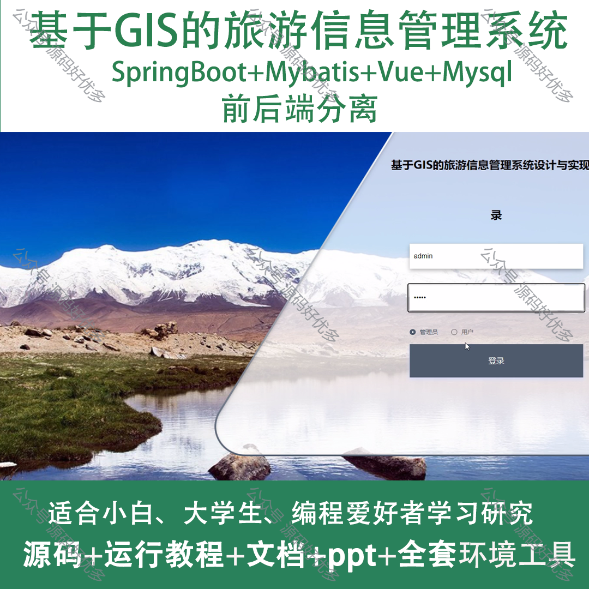
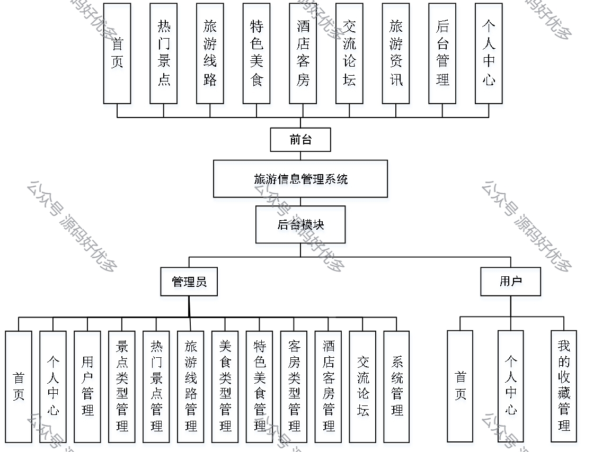
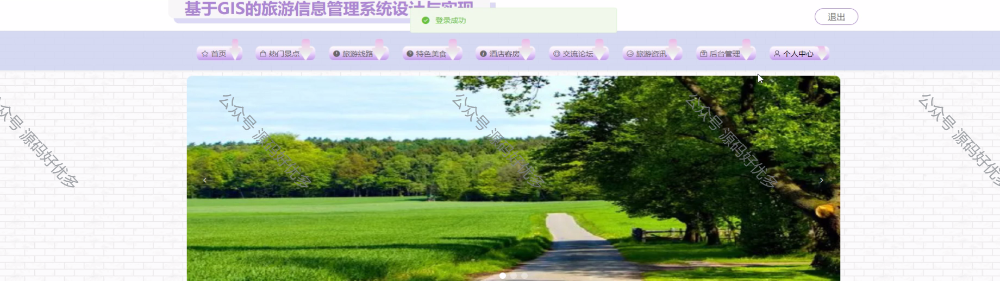
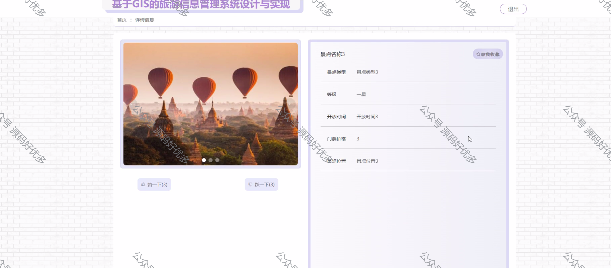
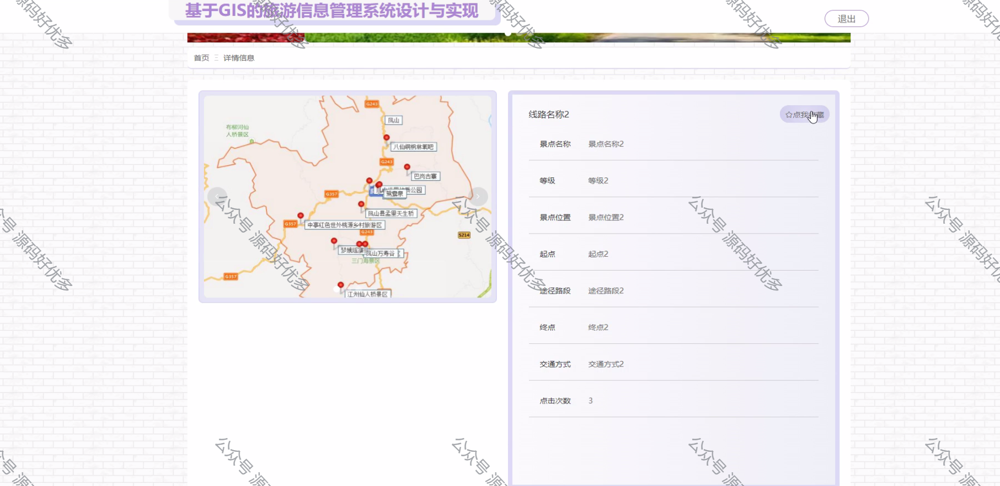
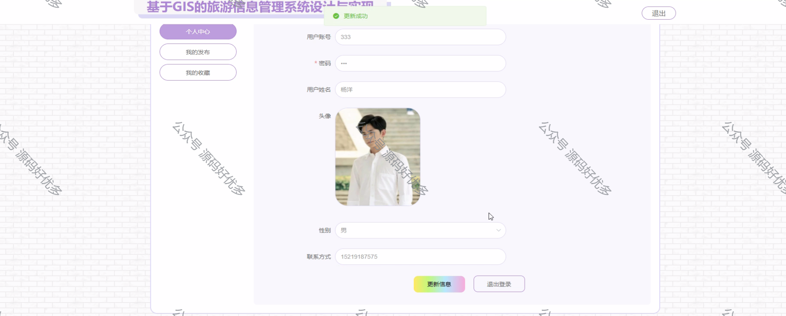
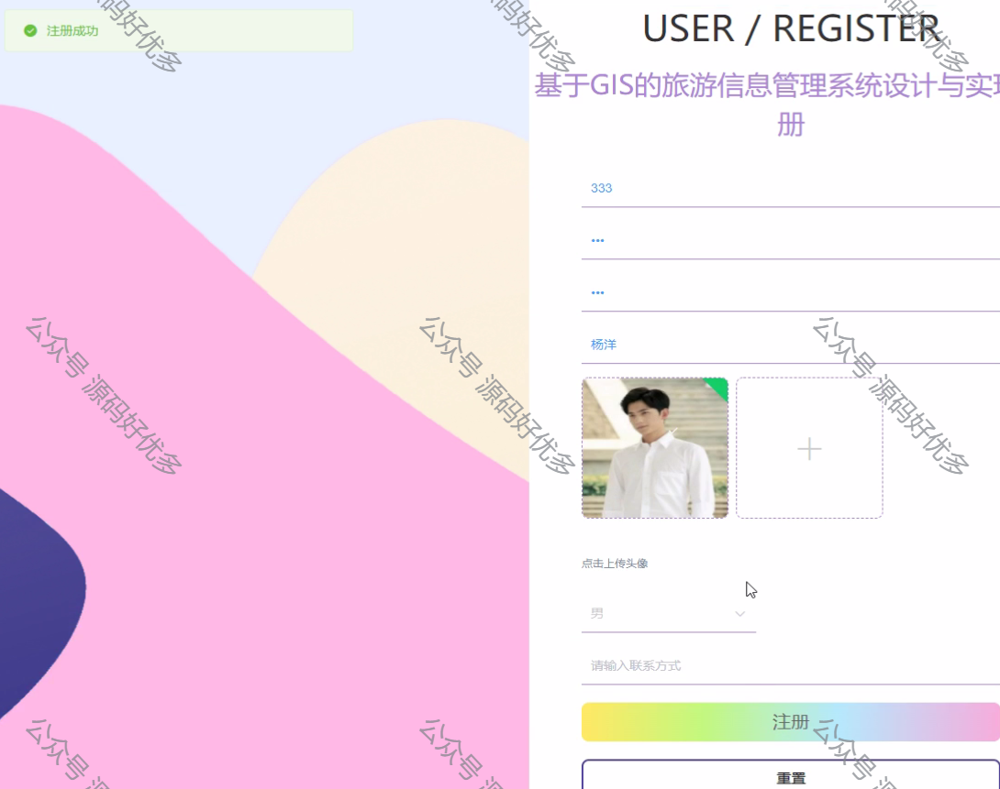
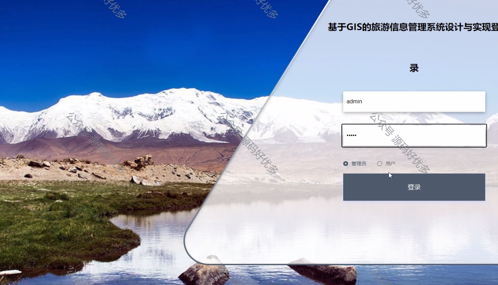
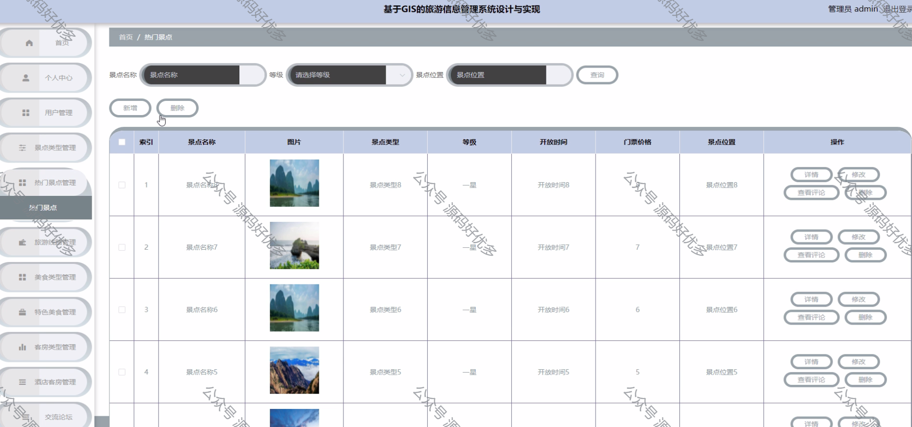
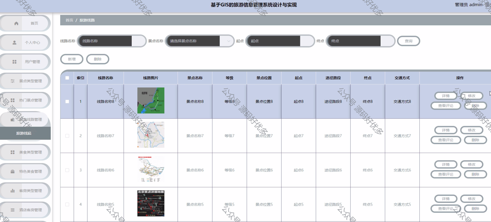
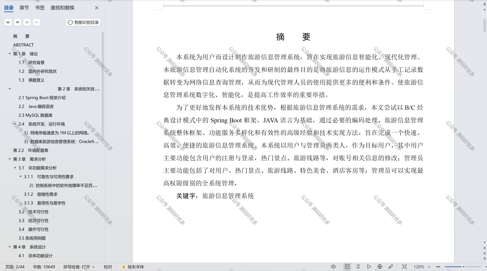

  
